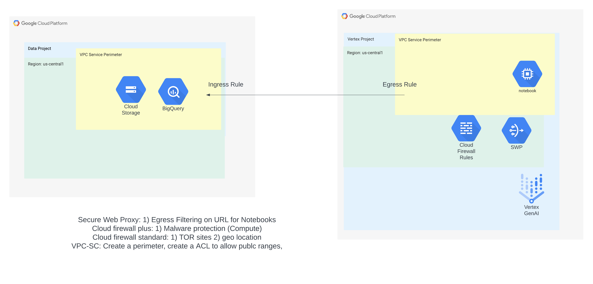

# GenAI Vertex Workbench Network Security Training Demo


This is not an officially supported Google product documentation.
This code creates a secure demo environment for Vertex AI Workbench. This demo code is not built for production workload. 


# Demo Guide
This demo uses terraform to setup secure Vertex AI Wrokbench network security in a project and underlying infrastructure using Google Cloud Services like  [Vertex-AI](https://cloud.google.com/vertex-ai), [Secure Web Proxy](https://cloud.google.com/secure-web-proxy), [VPC Service Controls](https://cloud.google.com/vpc-service-controls), [Cloud Firewall](https://cloud.google.com/firewall), [Identity and Access Management](https://cloud.google.com/iam), [Cloud Compute Engine](https://cloud.google.com/compute) and [Cloud Logging](https://cloud.google.com/logging).


## Demo Architecture Diagram
The image below describes the architecture of CSA Vertex AI Workbench demo to deploy a secure Workbench instance for development purposes.




## What resources are created?
Main resources:
- Two Projects (VertexAI and Data)
- Secure Web Proxy to allow only allowed domains
- Firewall to allow only permitted traffic and deny bad PIs/domains based on threat intel
- Two VPC Service Control Permieter for each project with allowed ingress and egress rules
- Private access for Goolge APIs
- Vertex AI Workbench Instance
- Optional: Firewall+ endpoint with server and client compute instances


## How to deploy?
The following steps should be executed in Cloud Shell in the Google Cloud Console. 

### Deployment Duration
Default configuration without FW+ (IPS): 25 mins (approx.)
Deployment with FW+ (IPS): 45 mins (approx.)

### 1. IAM Permission 
Grant the user running the terraform below roles.
``` 
Access Context Manager Editor
Billing Account User
Compute Network Admin
DNS Administrator
Folder Creator
Organization Policy Administrator
Project Creator
```


### 2. Get the code
Clone this github repository go to the root of the repository.

``` 
git clone https://github.com/GCP-Architecture-Guides/GenAI-Vertex-workbench-security.git
cd GenAI-Vertex-workbench-security
```

### 3. Deploy the infrastructure using Terraform


From the root folder of this repo, run the following commands:

```
export TF_VAR_organization_id=[YOUR_ORGANIZATION_ID]
export TF_VAR_billing_account=[YOUR_BILLING_ID]
export TF_VAR_vpc_sc_users=["user:NAME1@DOMAIN.com"]
export TF_VAR_instance_owners=["NAME1@DOMAIN.com"]
export TF_VAR_firewall_ips_enabled = [false] ## Default is false; set it to 'true' to enable firewall+ resources
terraform init
terraform apply
terraform apply --refresh-only
```

To find your organization id, run the following command: 
```
gcloud projects get-ancestors [ANY_PROJECT_ID]
```


**Note:** All the other variables are give a default value. If you wish to change, update the corresponding variables in variable.tf file.


## How to clean-up?

From the root folder of this repo, run the following command:
```
terraform destroy
```
**Note:** If you get an error while destroying, it is likely due to delay in VPC-SC destruction rollout. Just execute terraform destroy again, to continue clean-up.
